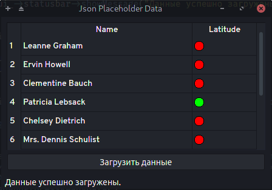

# qt-jsonplaceholder-table
This simple application will fetch JSON user data from jsonplaceholder.typicode.com via QTcpSocket to display it in a specific way inside QTableView widget.

The rules for the representation of the source data are as follows:
- Only two fields from the source data are displayed: name and address->geo->latitude.
- Name is displayed as-is.
- Latitude is represented as a simple shape.
- Positive or neutral latitude is a green circle.
- Negative latitude is a red circle.

